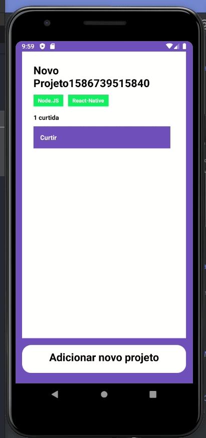

# desafio-conceitos-React-Native
Desafio desenvolvido pela RocketSeat para treinar os conceitos do desenvolvimento mobile do React Native

<h2>Objetivos</h2>

O objetivo desse desafio foi, desenvolver uma aplicação que consumisse uma API REST que permitisse 
  dar likes em um projeto postado, e que a quantidade de likes fossem armazenadas para cada projeto.

<h2>Extra</h2>

Para facilitar o teste da aplicação também criei um botão para adicionar novos projetos.

